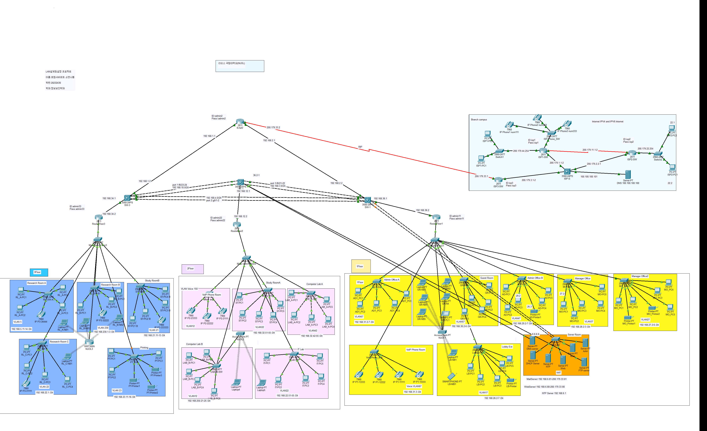

# NUOL Smart Campus Network

**라오스 국립대학교(NUOL) 스마트 캠퍼스 네트워크 구축 프로젝트**

[English](#english) | [한국어](#한국어) | [All project files / 전체 파일](docs/FILE_INDEX.md)



## English

### Project overview

A smart campus network design and simulation for the National University of Laos (NUOL), created for the **LAN Design and Configuration** course in the second semester of 2025. The project uses **Cisco Packet Tracer 9.0** to model a three-floor main campus and a connected branch campus.

The design brings together department-level network segmentation, routing, access control, campus services, wireless connectivity, and voice communication. It is an academic simulation based on a university campus scenario.

### Network design

| Area | Scope documented in the project report |
| --- | --- |
| Campus architecture | Main campus with three floors, departmental networks, and an external branch campus |
| Segmentation | VLANs for administration, laboratories, research rooms, study areas, guests, printing, and voice traffic |
| Routing and addressing | IPv4/IPv6 dual stack, OSPF, RIP, static routing, and NAT |
| Access control | ACL policies, including restricted guest access to the server network; AAA/RADIUS authentication |
| Campus services | DHCP, DNS, web, mail, FTP, Syslog, and NTP |
| User connectivity | Wired and wireless clients; VoIP across floors and campus networks |

### Campus layout

- **1F:** Administrative and manager offices, guest area, lobby, VoIP room, and server room.
- **2F:** Computer labs, IT lab, study area, and VoIP room.
- **3F:** Research rooms, study area, and printing room.
- **Branch campus:** A separate IPv4/IPv6 network connected to the main campus.

### Files to review first

| Artifact | Link |
| --- | --- |
| Integrated campus simulation | [Main campus Packet Tracer model](%ED%8F%AC%EC%97%A0%EC%82%AC%EB%B0%94%EB%A5%B4%ED%8A%B8%20%EC%86%8C%EB%B0%98%EB%82%98%EB%B4%89_20232430_NUOL.pkt) |
| Final report, 68 pages | [PDF report](%ED%8F%AC%EC%97%A0%EC%82%AC%EB%B0%94%EB%A5%B4%ED%8A%B8%20%EC%86%8C%EB%B0%98%EB%82%98%EB%B4%89_20232430%20%EB%A6%AC%ED%8F%AC%ED%8A%B8.pdf) |
| Editable report source | [HWP report](%ED%8F%AC%EC%97%A0%EC%82%AC%EB%B0%94%EB%A5%B4%ED%8A%B8%20%EC%86%8C%EB%B0%98%EB%82%98%EB%B4%89_20232430%20%EB%A6%AC%ED%8F%AC%ED%8A%B8.hwp) |
| Presentation | [PowerPoint presentation](%ED%8F%AC%EC%97%A0%EC%82%AC%EB%B0%94%EB%A5%B4%ED%8A%B8%20%EC%86%8C%EB%B0%98%EB%82%98%EB%B4%89_20232430_PPT.ppt) |
| Branch campus simulation | [Branch campus IPv4/IPv6 model](%EA%B0%81%20%EC%B8%B5%20%ED%8C%8C%EC%9D%BC/Branch_Campus_Internet_IPv4_IPv6.pkt) |
| Complete artifact inventory | [All 52 original files](docs/FILE_INDEX.md) |

The original submission contains **23 Packet Tracer models, 26 PNG topology images, one PDF report, one HWP report, and one PowerPoint presentation**. Original filenames and folder structure are preserved. [SHA-256 checksums](docs/FILE_MANIFEST.csv) are included for all original files.

### Open and run the simulation

1. Use **Cisco Packet Tracer 9.0**, the version identified in the project report.
2. Download the repository ZIP from GitHub's **Code → Download ZIP** menu, then extract the complete folder. Alternatively:

   ```shell
   git clone https://github.com/Tonyssp/nuol-smart-campus-network.git
   ```

   Access to this repository is required while it is private.
3. In Packet Tracer, choose **File → Open** and select the integrated `*_NUOL.pkt` model in the repository root.
4. Allow device initialization and protocol convergence in **Realtime** mode. Inspect the router and switch CLI, client addressing, and server services alongside the report.
5. Open the `.pkt` files under `각 층 파일/1F`, `2F`, and `3F` for individual floor and room configurations. Open `Branch_Campus_Internet_IPv4_IPv6.pkt` for the branch campus model.
6. Use **Simulation** mode to inspect packet flow. Suggested review checks include DHCP addressing, DNS resolution, permitted and restricted traffic under ACL policies, IPv4/IPv6 connectivity, and VoIP calls between configured phones.

### Validation and learning outcomes

The report documents configuration screenshots and communication tests, including ping and VoIP testing. Upload preparation verified the complete file inventory and that copied originals match their source SHA-256 checksums; Packet Tracer simulations were not rerun during upload.

The portfolio demonstrates campus topology planning, VLAN and IP addressing design, router/switch configuration, network access control, service integration, and troubleshooting of physical links and access/trunk settings.

## 한국어

### 프로젝트 소개

**2025년 2학기 「LAN 설계 및 설정」 교과목**에서 수행한 라오스 국립대학교(NUOL) 스마트 캠퍼스 네트워크 설계·시뮬레이션 프로젝트입니다. **Cisco Packet Tracer 9.0**을 사용하여 3층 규모의 본교 네트워크와 외부 Branch Campus를 구성했습니다.

부서별 네트워크 분리, 라우팅, 접근 제어, 서버 서비스, 무선 접속, 음성 통신을 하나의 캠퍼스 환경으로 통합했습니다. 대학 캠퍼스를 가정한 학습용 시뮬레이션 결과물입니다.

### 네트워크 설계 내용

| 구분 | 프로젝트 보고서에 기술된 구성 |
| --- | --- |
| 캠퍼스 구조 | 3층 본교, 부서별 네트워크, 외부 Branch Campus 연동 |
| 네트워크 분리 | 행정실, 실습실, 연구실, 학습 공간, Guest, 출력 및 음성 트래픽용 VLAN |
| 라우팅 및 주소 설계 | IPv4/IPv6 Dual Stack, OSPF, RIP, 정적 라우팅, NAT |
| 접근 제어 및 인증 | Guest의 서버망 접근 제한 등 ACL 정책, AAA/RADIUS 인증 |
| 서버 서비스 | DHCP, DNS, Web, Mail, FTP, Syslog, NTP |
| 사용자 연결 | 유·무선 단말 접속, 층별·캠퍼스 간 VoIP 통신 |

### 공간별 구성

- **1층:** 행정실, 관리자실, Guest 공간, 로비, VoIP실, 서버실.
- **2층:** 컴퓨터 실습실, IT 실습실, 학습 공간, VoIP실.
- **3층:** 연구실, 학습 공간, 출력실.
- **Branch Campus:** 본교와 연동되는 별도의 IPv4/IPv6 네트워크.

### 주요 결과물

| 결과물 | 링크 |
| --- | --- |
| 전체 캠퍼스 시뮬레이션 | [본교 Packet Tracer 모델](%ED%8F%AC%EC%97%A0%EC%82%AC%EB%B0%94%EB%A5%B4%ED%8A%B8%20%EC%86%8C%EB%B0%98%EB%82%98%EB%B4%89_20232430_NUOL.pkt) |
| 최종 보고서, 68페이지 | [PDF 보고서](%ED%8F%AC%EC%97%A0%EC%82%AC%EB%B0%94%EB%A5%B4%ED%8A%B8%20%EC%86%8C%EB%B0%98%EB%82%98%EB%B4%89_20232430%20%EB%A6%AC%ED%8F%AC%ED%8A%B8.pdf) |
| 편집 가능한 보고서 원본 | [HWP 보고서](%ED%8F%AC%EC%97%A0%EC%82%AC%EB%B0%94%EB%A5%B4%ED%8A%B8%20%EC%86%8C%EB%B0%98%EB%82%98%EB%B4%89_20232430%20%EB%A6%AC%ED%8F%AC%ED%8A%B8.hwp) |
| 발표 자료 | [PowerPoint 발표 자료](%ED%8F%AC%EC%97%A0%EC%82%AC%EB%B0%94%EB%A5%B4%ED%8A%B8%20%EC%86%8C%EB%B0%98%EB%82%98%EB%B4%89_20232430_PPT.ppt) |
| 외부 캠퍼스 시뮬레이션 | [Branch Campus IPv4/IPv6 모델](%EA%B0%81%20%EC%B8%B5%20%ED%8C%8C%EC%9D%BC/Branch_Campus_Internet_IPv4_IPv6.pkt) |
| 전체 파일 목록 | [원본 파일 52개](docs/FILE_INDEX.md) |

원본 제출물은 **Packet Tracer 파일 23개, PNG 토폴로지 이미지 26개, PDF 보고서 1개, HWP 보고서 1개, PowerPoint 발표 자료 1개**로 구성되어 있습니다. 원본 파일명과 폴더 구조를 유지했으며, 원본 전체의 [SHA-256 체크섬](docs/FILE_MANIFEST.csv)을 함께 제공합니다.

### 시뮬레이션 실행 방법

1. 보고서에서 사용한 버전인 **Cisco Packet Tracer 9.0**을 준비합니다.
2. GitHub의 **Code → Download ZIP**으로 저장소를 다운로드하고 전체 폴더를 압축 해제합니다. 다음 명령으로 복제할 수도 있습니다.

   ```shell
   git clone https://github.com/Tonyssp/nuol-smart-campus-network.git
   ```

   비공개 저장소인 동안에는 저장소 접근 권한이 필요합니다.
3. Packet Tracer에서 **File → Open**을 선택하고 저장소 루트의 `*_NUOL.pkt` 통합 모델을 엽니다.
4. **Realtime** 모드에서 장비 초기화와 프로토콜 수렴을 기다립니다. 보고서와 함께 라우터·스위치 CLI, 단말 주소 설정, 서버 서비스를 확인합니다.
5. `각 층 파일/1F`, `2F`, `3F`의 `.pkt` 파일로 층별·공간별 설정을 확인합니다. 외부 캠퍼스는 `Branch_Campus_Internet_IPv4_IPv6.pkt`를 엽니다.
6. **Simulation** 모드에서 패킷 흐름을 확인합니다. DHCP 주소 할당, DNS 조회, ACL에 따른 허용·차단 트래픽, IPv4/IPv6 연결, 설정된 전화기 간 VoIP 통화 등을 점검할 수 있습니다.

### 검증 및 학습 성과

원본 보고서에는 설정 화면과 ping·VoIP 등 통신 테스트가 포함되어 있습니다. 업로드 준비 과정에서는 전체 파일 목록과 원본 대비 SHA-256 일치 여부를 확인했으며, Packet Tracer 시뮬레이션을 다시 실행하지는 않았습니다.

캠퍼스 토폴로지 설계, VLAN·IP 주소 계획, 라우터·스위치 설정, 네트워크 접근 제어, 서버 서비스 통합, 물리 연결 및 access/trunk 설정 문제 해결 과정을 보여 주는 포트폴리오입니다.
